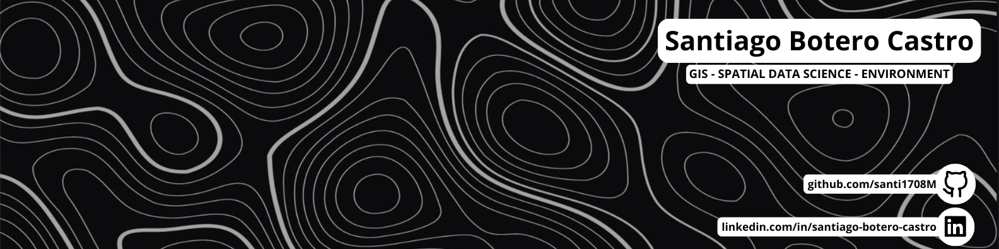

Hi there 👋, welcome!

I'm Santiago Botero Castro. I'm a forestry engineer working on data-driven projects and geographic information systems (GIS).

---

## Quick facts
- Email: sabotero@unal.edu.co  
- Resume: [Ver CV Online](CV.md) | [Descargar PDF](./assets/CV_SantiagoBotero_EN.pdf)

---

## About me
Passionate about spatial analysis, data management, and automation with Python. I work on projects that combine GIS, databases, and programming to support data-driven research and decision-making.

---

## Core skills
- Data analysis and processing with Python (pandas, geopandas)  
- Geographic Information Systems (QGIS, raster & vector processing)
- Relational and spatial databases (PostgreSQL / PostGIS, SQL modeling & queries)

---

## Tools
   

<!--
**santi1708M/santi1708M** is a ✨ _special_ ✨ repository because its `README.md` (this file) appears on your GitHub profile.

Here are some ideas to get you started:

- 🔭 I’m currently working on ...
- 🌱 I’m currently learning ...
- 👯 I’m looking to collaborate on ...
- 🤔 I’m looking for help with ...
- 💬 Ask me about ...
- 📫 How to reach me: ...
- 😄 Pronouns: ...
- ⚡ Fun fact: ...
-->
